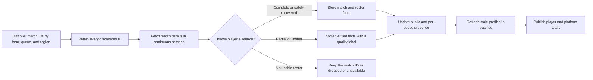

<!--
  PaladinsCat Blog — 24-hour observed active-player methodology
  Public-facing content. No source-code or private infrastructure references.
-->

# How PaladinsCat Counts Active Players

> The PaladinsCat activity total is a rolling count of distinct public player
> identities observed in tracked matches during the previous 24 hours. It is
> not an official concurrent-player count, a count of every Paladins account,
> or an estimate produced by multiplying match totals.

---

**Published:** July 2026 &nbsp;|&nbsp; **Topic:** Methodology · Player activity · Data transparency

---

## What the number means

The **Players · last 24 hours** number on
[PaladinsCat's activity page](https://paladinscat.com/stats/activity) answers a
specific question:

> How many distinct public player identities did PaladinsCat directly observe
> in the queues it tracked during the rolling 24-hour window?

If one player appears in ten matches, that player contributes **one** to the
headline total. If the player appears near the beginning and again near the end
of the window, the same identity is still counted once. Its last-observed time
is simply moved forward.

The simplified public-player calculation is:

```text
24-hour public players =
  count of distinct positive player IDs
  whose last observed match time is within the previous 24 hours
```

This is an **observed active population**. It should not be interpreted as:

- players online at the same instant;
- the total number of Paladins accounts;
- monthly or daily active users reported by Hi-Rez;
- an estimate of players in queues PaladinsCat did not track;
- a count inferred from Steam charts or another platform's concurrency.

The distinction matters. PaladinsCat reports evidence it observed, not an
official census.

---

## From an hourly match ID to one observed player

PaladinsCat discovers matches for registered queues and regions by completed
hour. The first result is an ID ledger: the match ID, queue, region, and source
hour. This ledger remains the record of what was discovered even when the
upstream match-detail service cannot return a complete roster.

The high-level flow is:



For each valid human participant with a positive player ID, PaladinsCat updates
a single global presence record:

- the first time the identity was observed;
- the most recent time it was observed;
- the most recent match and queue carrying the observation.

Observing the same ID again updates that record. It does not insert another
person into the headline count.

Bot participants are classified separately and are not inserted into the
public-player population.

---

## Why the queue totals overlap

The global count and the queue breakdown deliberately use different grouping
keys.

| Display | Identity key | What it answers |
|:---|:---|:---|
| All public players | Player ID | How many distinct public identities were observed anywhere in the tracked window? |
| Players by queue | Player ID + queue ID | How many distinct public identities appeared in this queue? |
| Players by platform | Player ID, then current known platform | How is the globally deduplicated public population distributed by platform? |

Suppose player `A` appears in Ranked Siege and Casual Siege during the same
24-hour period:

```text
Global total:          A counts once
Ranked Siege filter:   A appears once
Casual Siege filter:   A appears once
```

Player `A` must remain visible in both queue views because both observations
are true. Consequently, **queue totals overlap and must not be added together
to recreate the global total**.

The same rule is used on the transparency page. Selecting Ranked shows the
Ranked matches and player names retained for them; selecting Casual shows the
Casual evidence. A player who used both queues legitimately appears in both
filters.

---

## Complete, partial, limited, and dropped matches

A discovered match ID and a complete match roster are not the same thing.
PaladinsCat retains that distinction instead of silently removing inconvenient
results.

| Match evidence | What PaladinsCat can show | Effect on the player count |
|:---|:---|:---|
| Complete | Match ID and complete verified roster | Every valid public player ID can be observed |
| Recovered | Match ID and roster reconstructed from authoritative recovery evidence | Every validated public player ID can be observed |
| Partial or Limited | Match ID and only the verified participant rows that survived | Only identities actually supported by retained evidence can be observed |
| Dropped or unavailable | Match ID, queue, region, hour, and failure state; no usable roster | The match remains reportable, but contributes no guessed players |

This produces a conservative result. If the upstream service reports a match
ID but never supplies its roster, PaladinsCat knows that the match existed but
does not know which identities played it. The match remains visible as
discovered evidence. No synthetic ten-player estimate is added to the active
population.

Similarly, a partial response may prove that some named players participated
without proving the missing identities. PaladinsCat retains the proven rows and
does not fabricate the remainder.

These match-quality labels also protect unrelated statistics. Limited and
otherwise incomplete matches are not allowed to silently influence metrics
that require a complete, validated match.

---

## Public, private, unresolved, and bot identities

Identity quality changes what can be counted safely:

- **Public players** have a durable positive player ID. They form the main
  globally deduplicated total.
- **Resolved private players** have been connected to a stable internal private
  identity with sufficient evidence. They are reported separately from the
  public total.
- **Unresolved private observations** cannot be safely joined to a person.
  They are reported as observations, not unique players.
- **Bots** are classified as non-human participants and excluded from the
  player population.

An unresolved private slot may be the same person seen in another match, or it
may be a different person. Treating each slot as unique would inflate the
population; merging slots speculatively would hide uncertainty. PaladinsCat
does neither.

For the same reason, the transparency view does not publish a guessed identity
for a private participant. It shows the retained match evidence with a private
label.

### Reading the unresolved `+0–N` range

The confirmed public-player number remains the headline count. Beside it,
PaladinsCat publishes an unresolved range in the form `+0–N`:

- the **lower addition is zero**, because every unresolved slot could belong to
  a public player who was already counted elsewhere in the window;
- the **upper addition is N**, the deliberately conservative case in which
  every unresolved human slot belongs to a different person who appears
  nowhere else.

For a complete stored roster, only its explicitly private or unresolved human
rows contribute to `N`. For a partial, limited, dropped, or still-unavailable
PvP match, missing capacity can contribute up to ten human slots.

Training and PvE matches are handled differently. They can be started by a
single player, so unused team capacity is not evidence that another person was
present. These queues contribute only private or unresolved human roster rows
that Hi-Rez actually reported. A training or PvE match with no usable roster
therefore adds zero—not five—to the unresolved range.

The possible unique-player interval is therefore:

```text
confirmed public players
  through
confirmed public players + unresolved-slot upper bound
```

This is a transparency bound, not a statistical estimate or confidence
interval. The real value can fall anywhere inside it, and the upper bound will
usually overstate reality because players participate in multiple matches.

---

## How platform grouping is populated

Match details do not always provide enough current platform information for
every public identity. PaladinsCat therefore uses its player-profile records to
group the globally deduplicated population by platform.

Profiles use a 24-hour freshness rule:

1. identities observed in the current player window are checked for a recent
   profile;
2. a profile already refreshed by normal ingestion or a user lookup is reused;
3. only missing or older profiles are eligible for refresh;
4. eligible IDs are requested in batches of up to 20;
5. merged-account identifiers are recognized so an already resolved account is
   not immediately requested again;
6. refresh work respects the API-call safety reserve.

Until a profile supplies a usable platform, that identity remains in the
global total and is grouped as **Unknown**. Missing platform metadata must not
erase a known player observation.

The activity card publishes platform-coverage information so readers can see
how much of the current public population has known platform data.

---

## The window is rolling, not a calendar day

The count is evaluated against the previous 24 hours at the time the page is
requested. It does not reset at midnight.

For example, at 18:15 UTC, the active window begins at approximately 18:15 UTC
on the preceding day. A player whose last observation falls behind that
boundary leaves the total. If that player completes another tracked match,
their last-observed time moves forward and they remain in—or return to—the
window.

This rolling model avoids double-counting a player who appears in hour 1 and
hour 23. Both observations update one identity record.

---

## What is covered—and what is not

The methodology applies to queues explicitly registered for hourly presence
tracking. Queue definitions give each match a public classification such as
Ranked, Casual, bot, Arcade, Wave Defense, Experiment, Newcomer, or another
supported special mode.

Some match types cannot be exhaustively discovered by a practical hourly queue
scan. Custom matches are the clearest example: their queue identifiers may
vary by map and configuration. PaladinsCat can fetch and display a custom match
when its match ID is known, but a manually searched custom match is not
automatically evidence that the entire custom-match population was observed.

The 24-hour total is therefore bounded by:

- the queues and regions registered for presence discovery;
- successful hourly discovery from the upstream service;
- player identities returned in complete or retained partial evidence;
- the ability to distinguish public, private, and bot participants;
- the moving 24-hour boundary.

Upstream outages, empty rosters, incomplete responses, privacy, or an
unregistered queue can make the result a lower bound on actual activity.
PaladinsCat does not scale the number upward to compensate for unknown data.

---

## Inspecting the evidence

The **Details** control in the upper-right corner of the 24-hour player card
opens the [activity evidence page](https://paladinscat.com/stats/activity/details).

That page exposes:

- a **Matches** tab containing the complete tracked match-ID ledger as a plain
  list, including discovered or dropped IDs that have no roster;
- a **Players** tab containing the deduplicated public player names represented
  by the headline count, followed by each identity's distinct retained match
  count in the window;
- numbered pages with direct page selection so the full rolling window remains
  reachable without one unbounded response;
- player sorting by match count (highest first) or alphabetically;
- a queue filter shared by both tabs.

The Players tab uses the same identity rules as the count. Its global view
contains each public player ID once. A queue filter reads the separate
player-and-queue presence index, so a player who used Ranked and Casual appears
in both corresponding filtered lists without being counted twice globally.
The match count beside a player is also recalculated for the selected queue, so
it describes the visible filter rather than an unrelated global total.

This lets readers distinguish three quantities that should never be confused:

1. **tracked match IDs** — all matches discovered in the registered window;
2. **player observations** — retained participant rows attached to those
   matches;
3. **unique active players** — distinct durable public identities observed at
   least once in the rolling window.

---

## Reading the number responsibly

The strongest accurate description is:

> PaladinsCat observed this many distinct public player IDs in its tracked
> queues during the previous 24 hours.

It is not accurate to call it the official Paladins population, worldwide
concurrency, or the number of every person who played that day.

The purpose of publishing the methodology and the underlying match list is to
make both the value and its limits inspectable. The active-player total should
be reproducible from retained identities, conservative when evidence is
missing, and explicit about the queues and quality states behind it.

---

## Continue reading

- [**Open the live activity dashboard →**](https://paladinscat.com/stats/activity)
- [**Inspect the 24-hour match evidence →**](https://paladinscat.com/stats/activity/details)
- [**When Match Recovery Stops: Understanding Limited Matches →**](when-match-recovery-stops.md)
- [**Beyond the Int16 Overflow: Recovering the Match Hi-Rez Drops →**](beyond-int16-match-recovery.md)

---

*This article describes the PaladinsCat rolling activity methodology published
in July 2026. Queue coverage and acquisition quality remain visible in the live
activity evidence as the tracked window changes.*
