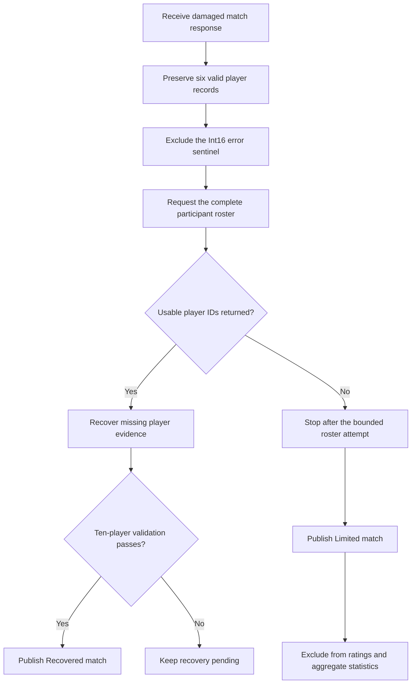

<!--
  PaladinsCat Blog — Limited Match Classification
  Public-facing content. No source code or private backend details.
-->

# When Match Recovery Stops: Understanding Limited Matches

> PaladinsCat can reconstruct many matches damaged by the skin ID overflow. When the missing participants cannot be identified safely, it preserves the verified evidence without pretending the match is complete.

---

**Published:** July 2026 &nbsp;|&nbsp; **Topic:** Data integrity · Match recovery · Transparent limitations

---

## Not every broken match can be fully recovered

Our [Int16 skin ID analysis](skin-id-overflow.md) documented how an affected
skin can interrupt the match-data response. Our
[match recovery post](beyond-int16-match-recovery.md) then showed how
PaladinsCat preserves the valid part of that response and reconstructs missing
players from independent match evidence.

That recovery succeeds only when the missing participants can be identified.
Usually, a separate participant lookup supplies the ten player IDs for the
match. PaladinsCat can compare those IDs with the surviving records, find the
missing players, and search only for the evidence needed to complete the
scoreboard.

Sometimes that participant lookup returns no IDs.

When this happens, PaladinsCat reaches an important boundary: the surviving
player records are real, but the identities of the missing players are unknown.
There is no safe target for further recovery. Instead of guessing, repeatedly
calling the same unavailable source, or presenting an incomplete roster as a
normal match, PaladinsCat classifies the result as **Limited**.

---

## Match `1280980059`: six verified players and no roster anchors

Match [`1280980059`](https://paladinscat.com/matches/1280980059) is a clear
example.

The raw match-details response contained seven objects:

| Response object | Count | Meaning |
|:---|---:|:---|
| Valid player records for match `1280980059` | 6 | Authoritative match facts that can be retained |
| Int16 `skin_id` error sentinel | 1 | An application-level error, not a player |

The six valid records formed an uneven surviving prefix:

| Team | Verified players returned |
|:---|---:|
| Team 1 | 5 |
| Team 2 | 1 |
| Missing from the expected ten-player roster | 4 |

The seventh object carried the known overflow error:

```text
Value was either too large or too small for an Int16. Failing Field = skin_id
```

This sentinel had no usable player identity and was correctly excluded from the
roster. It confirmed why the response stopped, but it could not identify the
four players whose rows never arrived.

PaladinsCat then made one participant-roster request for the match. That lookup
normally returns the ten participant profiles and their player IDs. For this
specific match, it returned an empty response:

```text
Participant profiles returned: 0
Usable player IDs returned:     0
```

The recovery pipeline therefore had six authoritative direct records, no newly
identified participants, and four unknown roster positions.

> [!IMPORTANT]
> An empty participant lookup does not erase the six valid match records.
> It means the four missing players cannot be identified reliably enough to
> reconstruct their match histories.

---

## Why player IDs are the recovery anchor

The missing records cannot be searched by “Team 2, slots two through five.”
Recovery needs durable player identities.

The participant lookup normally provides those identities in one response.
PaladinsCat uses the returned player IDs to:

1. establish the expected ten-player roster;
2. remove players whose direct match records already survived;
3. identify only the missing participants;
4. inspect evidence for the exact target match;
5. accept recovered rows only when the completed roster and match result pass
   validation.

Without those IDs, the pipeline cannot know which accounts occupied the four
missing positions. The surviving players' own records do not reveal the full
opposing roster, and unrelated profile or match data cannot be substituted as
proof.

The absence of player IDs is therefore not a cosmetic gap. It removes the key
that connects a missing roster position to an authoritative player history.

---

## The limited-match decision

The public recovery flow for this case is:



PaladinsCat permits the Limited classification only for a narrow shape:

- between one and nine authoritative player records survived;
- both teams are represented;
- the surviving records form a plausible match fragment;
- the participant-roster lookup was attempted once;
- that lookup failed or returned no usable player anchors;
- no profile-only or invented player record is promoted into the match.

Match `1280980059` meets that condition with six direct records split **5–1**
between the two teams and zero roster anchors returned by the participant
lookup.

The result is retained with the machine-readable reason
`roster_anchor_unavailable`.

---

## Why PaladinsCat does not keep retrying

An empty response can tempt a system into retrying indefinitely. For a
rate-limited data source, that is harmful and does not make the evidence more
authoritative.

The Limited state is terminal for this narrow recovery case. PaladinsCat makes
one bounded roster-anchor attempt, records the outcome, and stops automated
recovery for the match. This prevents one unrecoverable result from repeatedly
consuming requests that are needed for current matches and player lookups.

Stopping also protects data quality. Repeated requests cannot safely answer a
question when the source continues to return no participant IDs. A later guess
would still be a guess.

---

## What “Limited” means

Limited does not mean that every visible field is unreliable. It means the
available evidence is incomplete and must not be treated as a normal ten-player
match.

| State | Public meaning | Statistical use |
|:---|:---|:---|
| `Broken` | The original response failed or dropped data. | Depends on whether complete recovery succeeds |
| `Recovered` | Ten authoritative player rows were assembled and validation passed. | Eligible when all normal match requirements pass |
| `Limited` | Authoritative rows survived, but the complete roster could not be established. | Lookup only; excluded from projections |

For a Limited match:

- the surviving player rows remain visible;
- the missing roster is not fabricated;
- the limitation is shown on the match;
- the result is excluded from ratings;
- the result is excluded from player relationships and parties;
- the result is excluded from champion, performance, lobby-tier, and global
  aggregate statistics;
- the match cannot silently influence win rates or other public metrics.

This distinction keeps two goals separate: preserving genuine evidence for
players who want to inspect the match, and protecting aggregate statistics from
an incomplete roster.

---

## Transparency is better than false completeness

Most Int16-damaged matches can be reconstructed when the participant IDs and
target histories remain available. Match `1280980059` demonstrates the case
where the second source also fails.

PaladinsCat still knows six things with confidence: six player records were
returned directly for this match. It also knows what it cannot prove: the
identities and match facts of the other four participants.

The Limited classification preserves both truths.

It avoids the three misleading alternatives:

- **Discarding the match entirely**, which hides valid evidence.
- **Displaying six players as a complete match**, which misrepresents the
  roster.
- **Inventing or inferring the missing players**, which contaminates the
  scoreboard and every statistic derived from it.

Limited matches are uncommon edge cases, but making them visible is part of
PaladinsCat's data-provenance model. A clear limitation is more useful than a
confident answer unsupported by the available evidence.

---

## Continue reading

- [**The Int16 Skin ID API Failure →**](skin-id-overflow.md)
- [**Beyond the Int16 Overflow: Recovering the Match Hi-Rez Drops →**](beyond-int16-match-recovery.md)
- [**View limited match `1280980059` on PaladinsCat →**](https://paladinscat.com/matches/1280980059)

---

*The match response and recovery state described here were verified in July
2026. The article reflects PaladinsCat's documented recovery and data-integrity
rules at publication time.*
